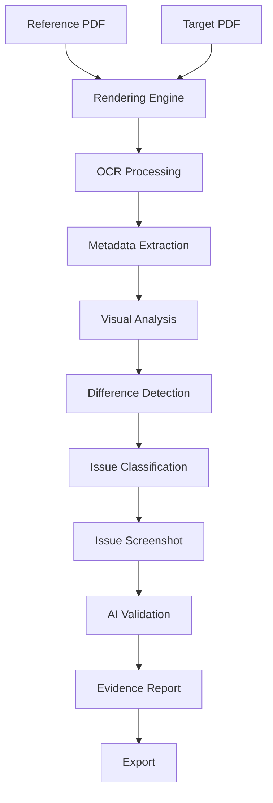

<p align="center">

</p>

<div align="center">

# AI Artwork Comparator

### Smart Proof QA Platform for Packaging Artwork Validation

### Enterprise AI • Computer Vision • OCR • Packaging QA


<br>


</div>

---
## Project Preview

<a href="https://www.loom.com/share/03c615737fd247b0b66658f97518541f" target="_blank">


</a>

👉 [Click here to watch full screen demo](https://www.loom.com/share/03c615737fd247b0b66658f97518541f)

---


# Overview

AI Artwork Comparator is an enterprise-grade Packaging Quality Assurance platform that automatically compares packaging artwork, labels, cartons, PDFs and images using Artificial Intelligence, OCR, Computer Vision and Retrieval-Augmented Generation (RAG).

The system identifies text differences, layout shifts, barcode mismatches, dimension inconsistencies, font changes, missing graphics, logo modifications and visual defects while producing detailed evidence reports with issue screenshots. It supports comparison between PDFs, images, Excel checklists and reviewer comments, with exports in Markdown, HTML, JSON, Excel and ZIP formats. :contentReference[oaicite:0]{index=0}

---

# Business Problem

Packaging artwork mistakes often lead to:

- Printing defects
- Wrong product labels
- Barcode failures
- Regulatory non-compliance
- Product recalls
- Manufacturing delays
- Increased production costs

Manual proofreading is time-consuming and error-prone.

AI Artwork Comparator automates artwork verification using AI-assisted inspection and evidence-based reporting.

---

# Objectives

- Automate Packaging QA
- Reduce Manual Proofreading
- Detect Visual Differences
- Compare PDF & Image Artwork
- Validate Barcodes & UPC
- Detect Missing Text
- Verify Dimensions
- Generate Evidence Reports
- Improve Production Quality
- Reduce Packaging Errors

---

# Enterprise Features

- PDF Comparison
- Image Comparison
- OCR Text Analysis
- Visual Difference Detection
- Heatmap Generation
- Layout Analysis
- Barcode Validation
- UPC Detection
- Font Comparison
- Dimension Verification
- Missing Text Detection
- Extra Text Detection
- Logo Detection
- Excel Checklist Validation
- Reviewer Comment Validation
- HTML Evidence Report
- JSON Report
- Markdown Report
- Excel Export
- ZIP Report Bundle
- AI Vision Review
- OpenRouter Integration
- Batch Processing

---

# AI Capabilities

The platform combines multiple Artificial Intelligence techniques including:

- Computer Vision
- OCR
- Semantic Similarity
- Retrieval Augmented Generation
- AI Vision Analysis
- Prompt Engineering
- Large Language Models
- Layout Intelligence
- Image Difference Detection
- Quality Scoring

---

# System Architecture

```text
                    User
                      │
                      ▼
             Streamlit Dashboard
                      │
          ┌───────────┴───────────┐
          │                       │
          ▼                       ▼
    PDF Processing         Image Processing
          │                       │
          └───────────┬───────────┘
                      ▼
            OCR & Metadata Engine
                      │
          ┌───────────┼───────────┐
          ▼           ▼           ▼
      Vision AI   Text AI    Layout AI
          │           │           │
          └───────────┼───────────┘
                      ▼
             Difference Engine
                      │
          ┌───────────┼───────────┐
          ▼           ▼           ▼
      Heatmaps    Screenshots   Reports
                      │
                      ▼
              HTML • Excel • ZIP
```

---

# AI Workflow



---

# Quality Assurance Pipeline

```text
Reference Artwork
        │
        ▼
Target Artwork
        │
        ▼
PDF Rendering
        │
        ▼
OCR Extraction
        │
        ▼
Text Comparison
        │
        ▼
Visual Comparison
        │
        ▼
Barcode Validation
        │
        ▼
Layout Verification
        │
        ▼
Issue Classification
        │
        ▼
Evidence Generation
        │
        ▼
Final QA Report
```

---

# Comparison Modes

The application supports multiple validation modes.

### PDF vs PDF

Compares packaging artwork between two PDF files.

---

### Image vs Image

Detects visual and graphical differences.

---

### PDF vs Excel Checklist

Validates artwork against predefined QA requirements.

---

### PDF vs Reviewer Comments

Checks artwork using reviewer observations.

---

### Automatic Detection

Automatically identifies the appropriate comparison workflow.

---

# AI Detection Modules

- OCR Validation
- Font Detection
- Logo Detection
- Layout Shift Detection
- Barcode Verification
- UPC Matching
- Dimension Verification
- Missing Graphics
- Missing Text
- Extra Text
- Visual Difference Detection
- Heatmap Generation
- Bounding Box Detection
- Screenshot Evidence
- Severity Classification

---

# Severity Classification

| Level | Description |
|---------|------------|
| Critical | Barcode mismatch, wrong dimensions, missing logo, missing page |
| High | Important content changed, major layout issue |
| Medium | Font changes, alignment issues, formatting changes |
| Low | Minor spacing, punctuation and cosmetic issues |

---

# Generated Outputs

The application automatically generates:

- HTML Evidence Report
- Markdown QA Report
- JSON Structured Report
- Excel QA Report
- Difference Heatmaps
- Issue Screenshots
- ZIP Output Package

---     

# Technology Stack

| Layer | Technology |
|--------|------------|
| Programming Language | Python 3.11 |
| Frontend | Streamlit |
| AI Framework | LangChain |
| Multi-Agent Workflow | LangGraph |
| AI Models | OpenRouter |
| OCR Engine | PyMuPDF |
| Computer Vision | OpenCV |
| Image Processing | Pillow |
| Numerical Processing | NumPy |
| Data Analysis | Pandas |
| Spreadsheet Processing | OpenPyXL |
| PDF Processing | PyMuPDF |
| Fuzzy Matching | RapidFuzz |
| Image Analysis | Scikit-Image |
| Configuration | Python Dotenv |

---

# API Integration

The platform supports AI-powered review using OpenRouter APIs.

### Environment Variables

```env
OPENROUTER_API_KEY=your_api_key
OPENROUTER_MODEL=openai/gpt-oss-120b
OPENROUTER_VISION_MODEL=google/gemma-4-31b-it
```

---

# AI Services

## OCR Analysis

Extracts:

- Product Text
- Font Information
- Position Coordinates
- Dimensions
- Metadata

---

## Computer Vision

Detects:

- Visual Changes
- Missing Objects
- Color Differences
- Heatmaps
- Bounding Boxes

---

## AI Review

Uses OpenRouter to provide:

- Intelligent QA Review
- Packaging Analysis
- Text Validation
- Vision Review
- Compliance Suggestions

---

# Processing Workflow

```text
Upload Files
      │
      ▼
PDF Rendering
      │
      ▼
OCR Extraction
      │
      ▼
Metadata Analysis
      │
      ▼
Visual Comparison
      │
      ▼
Difference Detection
      │
      ▼
Issue Classification
      │
      ▼
AI Validation
      │
      ▼
Evidence Report
```

---

# Output Reports

The application automatically exports

### HTML Evidence Report

Interactive report with embedded issue screenshots.

---

### Markdown Report

Developer-friendly QA report.

---

### JSON Report

Machine-readable structured output.

---

### Excel Report

Issue list with QA checklist.

---

### Difference Images

Visual comparison heatmaps.

---

### Issue Screenshots

Side-by-side

Reference

vs

Target

comparison.

---

### ZIP Bundle

Contains every generated report in one archive.

---

# Project Structure

```text
AI-Artwork-Comparator
│
├── app/
│   ├── main.py
│   ├── compare_engine.py
│   ├── report_generator.py
│   ├── ui.py
│   ├── ai_review.py
│   ├── image_utils.py
│   ├── pdf_processor.py
│   ├── checklist.py
│   ├── exports.py
│   └── helpers.py
│
├── outputs/
│
├── assets/
│
├── reports/
│
├── requirements.txt
├── README.md
├── .env.example
└── run_app.bat
```

---

# Installation

Clone Repository

```bash
git clone https://github.com/yourusername/AI-Artwork-Comparator.git
```

Move to project

```bash
cd AI-Artwork-Comparator
```

Install packages

```bash
pip install -r requirements.txt
```

Configure environment

```env
OPENROUTER_API_KEY=
OPENROUTER_MODEL=
OPENROUTER_VISION_MODEL=
```

Run Application

```bash
streamlit run app/main.py
```

or

Windows

```bash
run_app.bat
```

Linux

```bash
bash run_app.sh
```

---

# Supported File Types

### Input

- PDF
- PNG
- JPG
- JPEG
- XLSX
- TXT

---

### Output

- HTML
- Markdown
- JSON
- Excel
- PNG
- ZIP

---

# Enterprise Applications

- Packaging Industry
- Printing Industry
- Pharmaceutical Labels
- FMCG Packaging
- Food Packaging
- Beverage Labels
- Medical Packaging
- Cosmetic Packaging
- Manufacturing QA
- Regulatory Compliance

---

# AI Quality Checks

- Missing Text
- Extra Text
- Font Changes
- Barcode Validation
- UPC Detection
- Dimension Validation
- Logo Verification
- Image Difference
- Layout Shift
- Color Difference
- Object Detection
- OCR Confidence
- Metadata Validation

---

# Security Features

- Secure API Keys
- Environment Variables
- AI Validation
- Structured Reports
- Local Processing
- Safe File Handling

---

# Performance

- Fast PDF Rendering
- OCR Optimization
- AI Assisted Review
- Multi-page Processing
- Batch Comparison
- High Resolution Rendering
- Optimized Heatmap Generation

---

# Future Enhancements

- Docker Deployment
- Kubernetes Support
- SAP Integration
- ERP Integration
- AI Defect Prediction
- Real-time Packaging Inspection
- Live Camera QA
- Mobile Application
- Cloud Storage
- Enterprise Authentication
- Multi-language OCR
- Barcode Scanner Integration

---

# Developer

## SNEHAL LAXMAN JADHAV

### AI Engineer

### Navneet Education Limited

---

# License

MIT License

---

<div align="center">

# Intelligent Packaging Quality Assurance

### Computer Vision • OCR • AI • Enterprise Automation

**Python • Streamlit • OpenCV • OCR • LangChain • LangGraph • OpenRouter • Computer Vision**

<br>


<br><br>

### Developed by

# SNEHAL LAXMAN JADHAV

### AI Engineer

### Navneet Education Limited

</div>

<p align="center">

</p>
